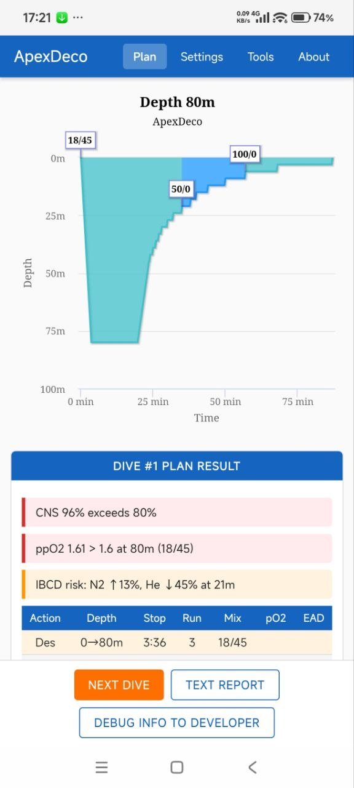
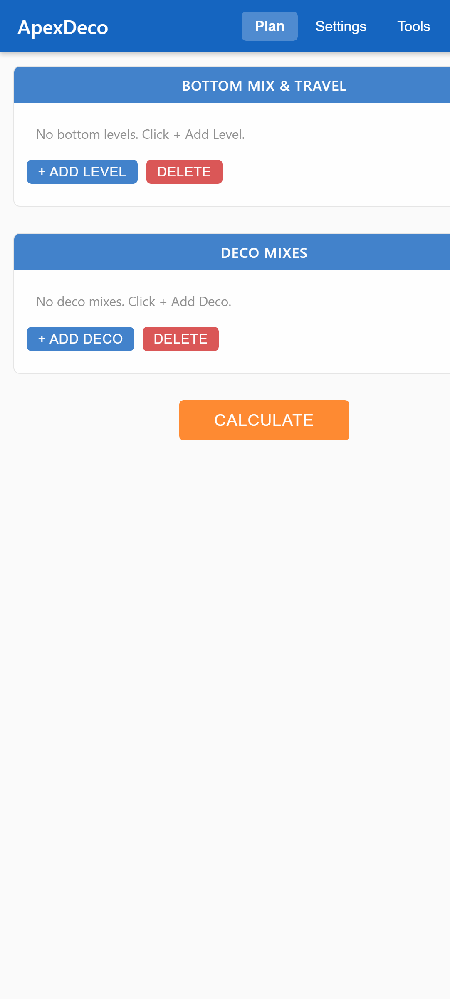
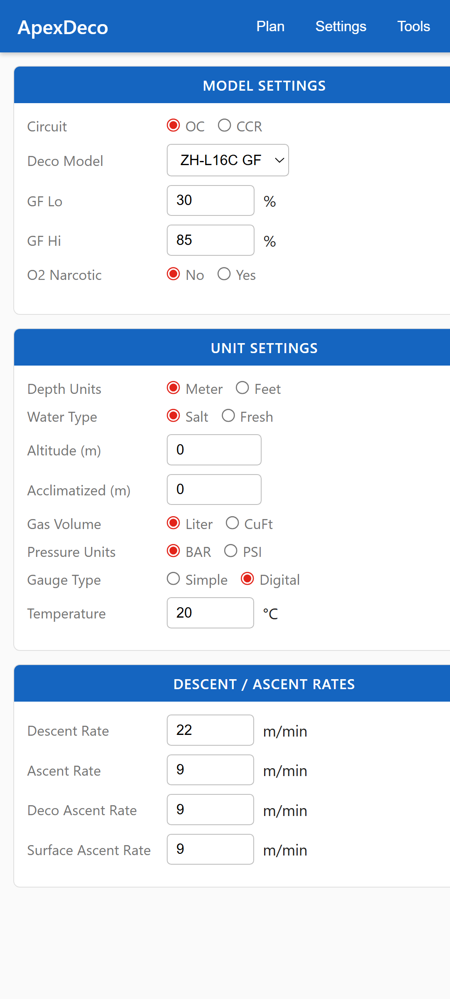
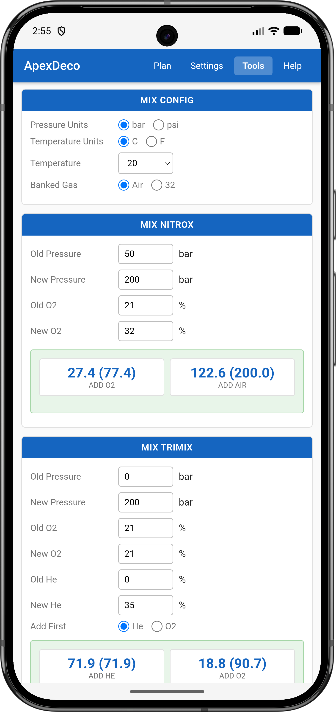
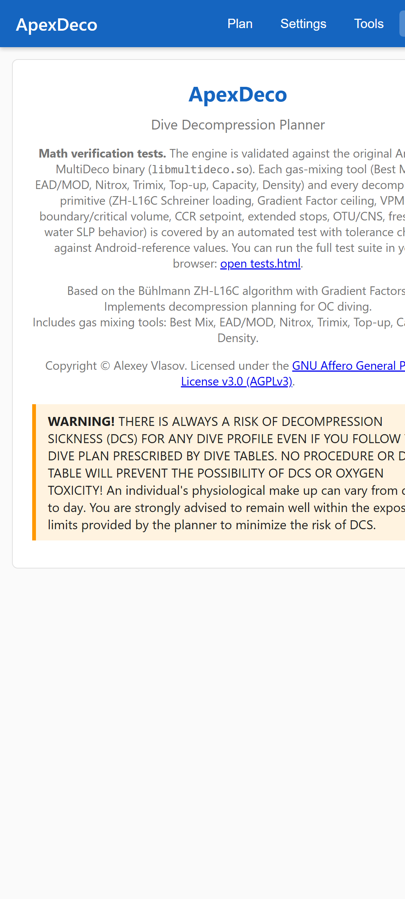
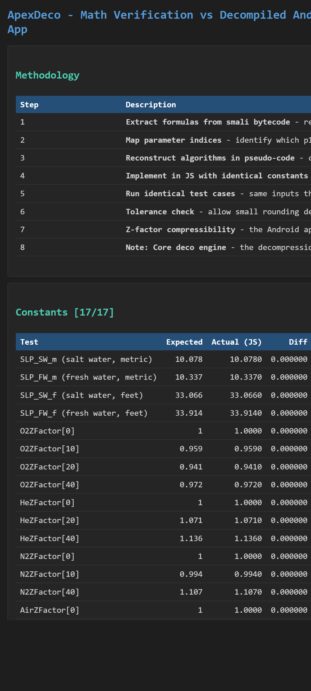

# ApexDeco

<p align="center">
  
</p>

<p align="center">
  <b>A browser-based mixed-gas decompression planner</b><br>
  Bühlmann ZH-L16C with Gradient Factors, VPM-B / VPM-A / VPM-B/E / VPM-B/GFS, OC and CCR
</p>

<p align="center">
  
  
  
  
  
  
</p>

## About
Try the online version first: https://vlasovalexey.github.io/ApexDeco/html-src/

**ApexDeco** is an open technical diving decompression planner that runs entirely in your web browser. No server, no installation, no telemetry. It produces detailed ascent schedules for trimix, nitrox and air dives on open circuit or closed circuit rebreathers, using the two most widely trusted decompression models in technical diving: **Bühlmann ZH-L16C with Gradient Factors** and **VPM-B** (plus VPM-A, VPM-B/E, VPM-B/GFS variants).

Every equation in this planner has been cross verified against a well known native reference implementation. The regression suite (https://vlasovalexey.github.io/ApexDeco/html-src/tests.html) contains hundreds of numerical assertions that lock JS output to the native reference within one percent on reference profiles, including a full multi level trimix dive (80 m for 26 min, 30 m for 30 min, 70 m for 28 min) matching to the minute.

> This project is not affiliated with, endorsed by, or derived from the source code of any commercial dive planning software. All algorithms are re implemented from published scientific literature and verified numerically.

## Screenshots

<p align="center">
  
  
  
</p>
<p align="center">
  
  
  
</p>

## Features

### Decompression models
- **Bühlmann ZH-L16C** with customizable Gradient Factors (GF Lo and GF Hi)
- **VPM-B** (Varying Permeability Model, Baker, Yount, Maiken)
- **VPM-A** (classic VPM without Boyle's law compensation)
- **VPM-B/E** (Extended VPM-B for deep dives)
- **VPM-B/GFS** (VPM-B with Bühlmann style gradient factor surfacing)
- **VPM-B/FBO** (Fast Bailout with reduced Boyle's correction)
- Conservatism levels **+0 through +5** for all VPM variants

### Dive configuration
- Metric and Imperial units
- Salt water and fresh water
- Altitude diving with optional acclimatization
- Open Circuit and Closed Circuit Rebreather (CCR) with configurable setpoints
- Multi level dives with proper inter level deco ascents
- Multiple bottom gases and travel gases
- Unlimited deco gases with automatic switch selection
- Configurable ascent, descent, deco ascent and surface ascent rates
- Configurable step size, minimum stop time, last stop depth (OC and CCR separately)
- Multi dive planning with surface interval and tissue carry over
- Two week rolling OTU tracking

### Physiology and limits
- **CNS percent** using the native reference rate table (0.50 to 2.00 bar ppO2)
- **OTU** using the Repex formula
- **Gas density** warning (Mitchell limits)
- **Isobaric Counter Diffusion (IBCD)** warnings for N2 and He spikes on gas switches
- Configurable warning thresholds for ppO2 high, ppO2 low, CNS, OTU

### Output
- Detailed run time table (descent, level, ascent, stop, surfacing) with mix, ppO2, EAD
- Gas consumption by cylinder size and fill pressure
- Decozone start depth
- Ready to copy plain text export of the full plan
- Interactive profile chart (Highcharts)

### Tools
- **Best Mix** for target depth and ppO2
- **EAD, END, MOD** calculator
- **Nitrox blender** (partial pressure topping)
- **Trimix blender**
- **Cylinder capacity** converter
- **Top up** calculator
- **Gas density** calculator

### Safety and plan validation
- Bailout plan generator (OC bailout from a CCR dive)
- Cave type bailout (thirds rule)
- Automatic gas switch validation against ppO2 limits
- CCR diluent ppO2 check
- Extended stop mode for additional conservatism

## Decompression math, verification

| Reference profile | Native runtime | ApexDeco runtime | Delta |
|---|---:|---:|---:|
| 80 m for 26 min, 30 m for 30 min, 70 m for 28 min, air, VPM-B +2 | 333 min | 333 min | 0.0 percent |
| 50 m for 30 min, EAN32, GF 30/85 | matches | matches | under 1 percent |
| Various short profiles (NDL, shallow deco) | matches | matches | under 1 percent |

Open https://vlasovalexey.github.io/ApexDeco/html-src/tests.html in your browser to run the full math verification suite.

## Getting started

Try the online version: https://vlasovalexey.github.io/ApexDeco/html-src/

ApexDeco is a static web app. No build step, no dependencies to install.

### Use it online
Open `index.html` in any modern browser (Chrome, Firefox, Edge, Safari).

### Use it locally (recommended)
```bash
git clone https://github.com/YOUR-USER/ApexDeco.git
cd ApexDeco/release_01
# any static file server works, for example
python -m http.server 8080
# then navigate to http://localhost:8080/
```

> Serving via `file://` works too, but some browsers restrict `localStorage` on that protocol. A local static server is recommended.

### Use it offline
Because everything runs in the browser, you can zip the `ApexDeco/` folder and carry it on any laptop, USB stick or tablet. No network is required at runtime.

## Architecture

```
ApexDeco/
  index.html               Main planner UI
  tests.html               Math verification and regression suite
  deco-engine.js           Bühlmann ZH-L16C plus GF engine
  vpm-engine.js            VPM-A, VPM-B, VPM-B/E, VPM-B/GFS engine
  app-*.js                 UI layers (state, config, levels, result, debug)
  profile-chart.js         Highcharts profile rendering
  tool-*.js                Stand alone dive tools
  ...
  res/                     Static assets (logo, screenshots)
```

The two decompression engines are completely independent of the UI and can be embedded in any other JS project:

```js
const settings = DecoEngine.createDefaultSettings();
settings.metric = true;
settings.gfLo = 30;
settings.gfHi = 85;

const levels = [{ depth: 40, time: 25, o2: 21, he: 35 }];
const decos  = [{ o2: 50, he: 0 }, { o2: 100, he: 0 }];

// Bühlmann
const plan = DecoEngine.calculate(levels, decos, settings);

// VPM-B
settings.conservatism = 2;
const vpmPlan = VPMEngine.calculate(levels, decos, settings, 'VPMB');
```

## Disclaimer

> WARNING! THERE IS ALWAYS A RISK OF DECOMPRESSION SICKNESS (DCS) FOR ANY DIVE PROFILE EVEN IF YOU FOLLOW THE DIVE PLAN PRESCRIBED BY DIVE TABLES. NO PROCEDURE OR DIVE TABLE WILL PREVENT THE POSSIBILITY OF DCS OR OXYGEN TOXICITY! An individual's physiological make up can vary from day to day. You are strongly advised to remain well within the exposure limits provided by the planner to minimize the risk of DCS.

## Contributing

Contributions are welcome, especially:
- Additional regression test cases (compare against a published reference and add the profile plus expected numbers to `tests.html`)
- UI and UX improvements
- Translations
- Documentation and dive theory references

Please keep the ZHL-16 engine (`deco-engine.js`) numerically unchanged unless you accompany the change with regression test evidence. The Bühlmann engine is considered stable and is used as the baseline for cross model validation.

## References

- A. A. Bühlmann, *Tauchmedizin* (Springer, 5th ed.)
- Erik C. Baker, *Clearing Up The Confusion About Deep Stops*
- Erik C. Baker, *Understanding M Values*
- D. E. Yount and E. B. Maiken, *Varying Permeability Model* papers
- NOAA Diving Manual, CNS and OTU reference tables

## License

AGPLv3. See [LICENSE](LICENSE) for details.
